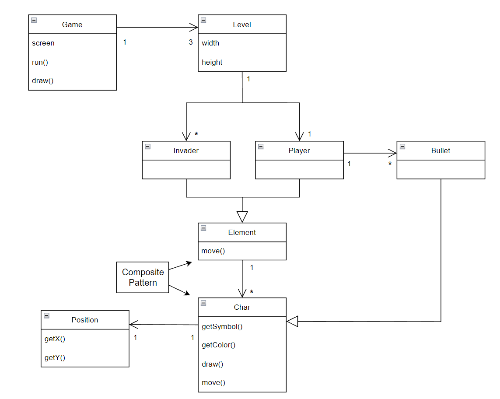

## LPOO_T11G03 - Space Invaders

> This project is intended to recreate one of the most iconic games of the 80´s, Space Invaders. In this game you help humanity from aliens by destroying as many spaceships as you can.
> This project was developed by *Luís Contreiras* (*up202108742*@fe.up.pt) , *Diogo Santos* (*up202108747*@fe.up.pt) e *Domingos Neto* (*up202108728*@fe.up.pt) for LP00 2022/23.

### FEATURES

> **Movement** - The spaceship moves freely inside the borders of the screen with the arrow keys.
> **Attack** - When the user clicks space the spaceship throws a bullet that will affect alien spaceships.
> **Enemy's** - Creation of enemy ships.

### PLANNED FEATURES

> **Damage** - When the spaceship gets attacked it loses the char that was damaged until there are no char members left.
> **Alien Attack** - Aliens may throw different kinds of bullets with different sizes and movement patterns.
> **SpaceShip Upgrade** - Every level the spaceship will be upgraded with more chars (more lives).
> **Enemy's difficulty** - Every level will increase the difficulty of the game by modifying the characteristics of the enemy´s spaceships.

## UML Class Diagram

A UML class diagram showcasing used Design Patterns:

### DESIGN PATTERNS

>**Implemented:** 

>**To Implement:**

------

#### THE JUMP ACTION OF THE KANGAROOBOY SHOULD BEHAVE DIFFERENTLY DEPENDING ON ITS STATE

**Problem in Context**

There was a lot of scattered conditional logic when deciding how the KangarooBoy should behave when jumping, as the jumps should be different depending on the items that came to his possession during the game (an helix will alow him to fly, driking a potion will allow him to jump double the height, etc.). This is a violation of the **Single Responsability Principle**. We could concentrate all the conditional logic in the same method to circumscribe the issue to that one method but the **Single Responsability Principle** would still be violated.

**The Pattern**

We have applied the **State** pattern. This pattern allows you to represent different states with different subclasses. We can switch to a different state of the application by switching to another implementation (i.e., another subclass). This pattern allowed to address the identified problems because […].

**Implementation**

The following figure shows how the pattern’s roles were mapped to the application classes.

These classes can be found in the following files:

- [Character](https://web.fe.up.pt/~arestivo/page/courses/2021/lpoo/template/src/main/java/Character.java)
- [JumpAbilityState](https://web.fe.up.pt/~arestivo/page/courses/2021/lpoo/template/src/main/java/JumpAbilityState.java)
- [DoubleJumpState](https://web.fe.up.pt/~arestivo/page/courses/2021/lpoo/template/src/main/java/DoubleJumpState.java)
- [HelicopterState](https://web.fe.up.pt/~arestivo/page/courses/2021/lpoo/template/src/main/java/HelicopterState.java)
- [IncreasedGravityState](https://web.fe.up.pt/~arestivo/page/courses/2021/lpoo/template/src/main/java/IncreasedGravityState.java)

**Consequences**

The use of the State Pattern in the current design allows the following benefits:

- The several states that represent the character’s hability to jump become explicit in the code, instead of relying on a series of flags.
- We don’t need to have a long set of conditional if or switch statements associated with the various states; instead, polimorphism is used to activate the right behavior.
- There are now more classes and instances to manage, but still in a reasonable number.

#### KNOWN CODE SMELLS AND REFACTORING SUGGESTIONS

> This section should describe 3 to 5 different code smells that you have identified in your current implementation, and suggest ways in which the code could be refactored to eliminate them. Each smell and refactoring suggestions should be described in its own subsection.

**Example of such a subsection**:

------

#### DATA CLASS

The `PlatformSegment` class is a **Data Class**, as it contains only fields, and no behavior. This is problematic because […].

A way to improve the code would be to move the `isPlatformSegmentSolid()` method to the `PlatformSegment` class, as this logic is purely concerned with the `PlatformSegment` class.

### TESTING

- Screenshot of coverage report.
- Link to mutation testing report.

### SELF-EVALUATION

- Luís Contreiras: 33%
- Diogo Santos: 33%
- Domingos Neto: 33%

