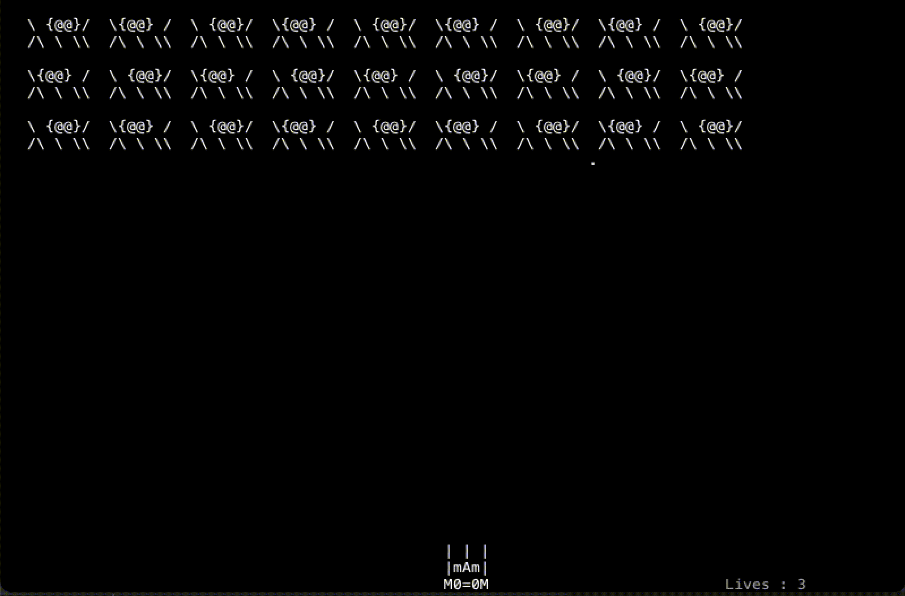
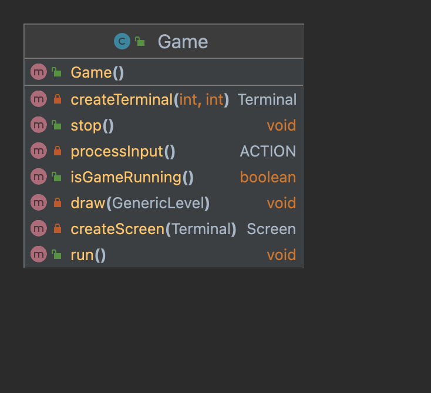
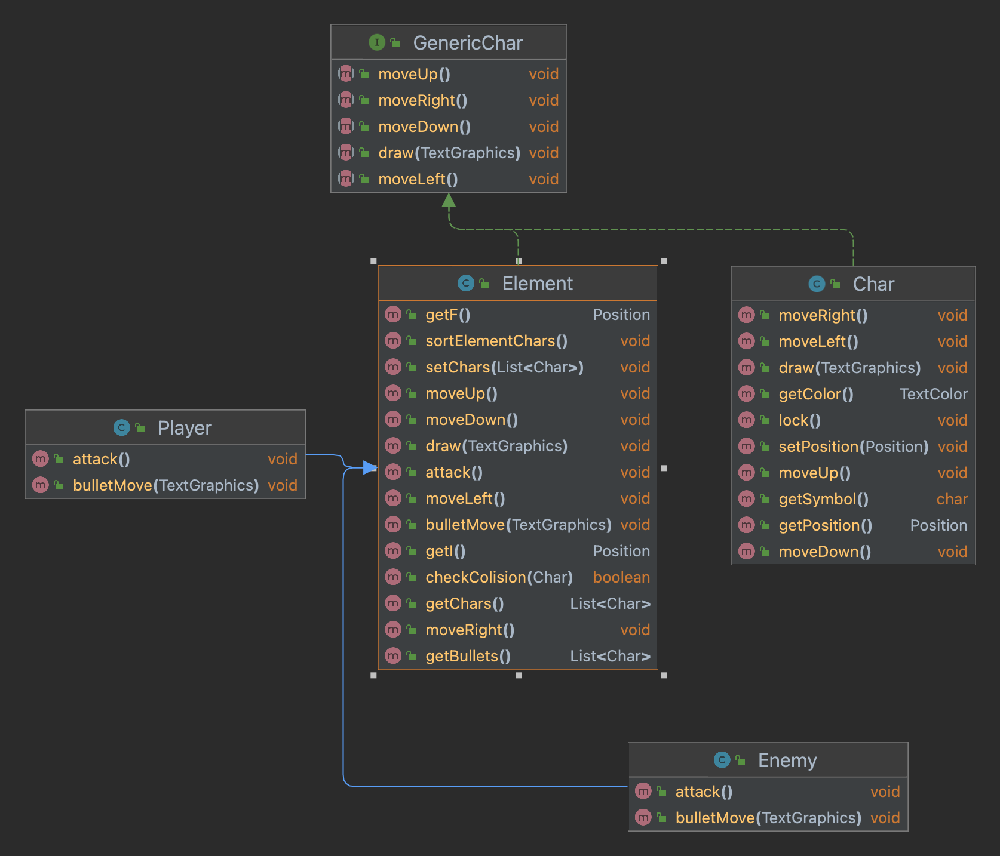
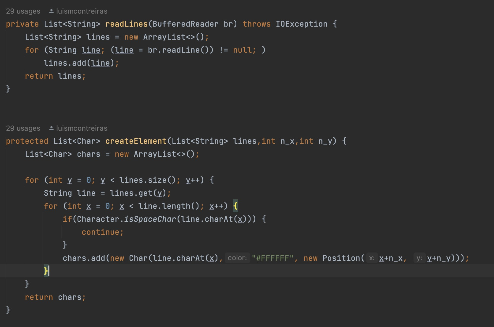
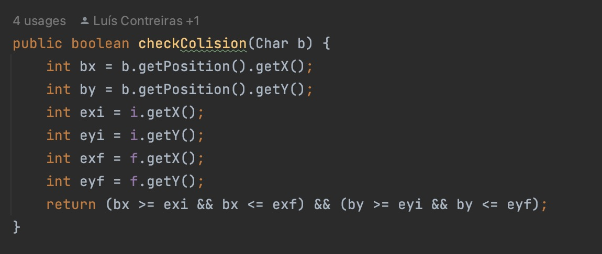
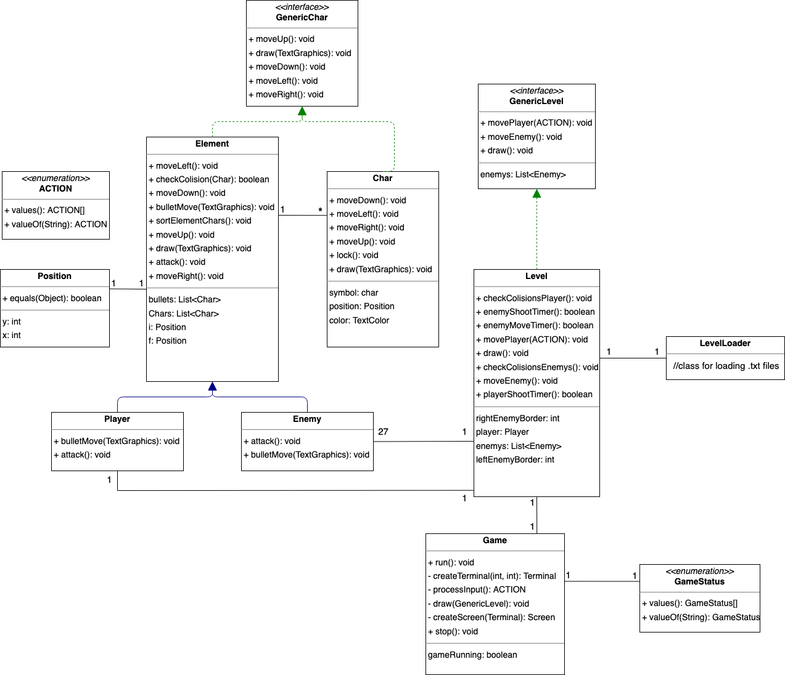
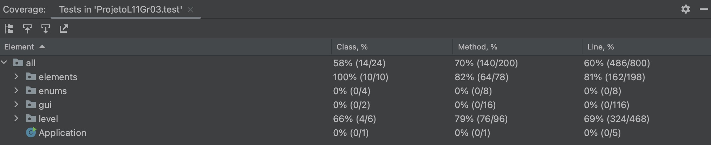

## LDTS_T11G03 - Space Invaders

This project is intended to recreate one of the most iconic games of the 80s, Space Invaders. In this game, you help humanity from aliens by destroying as many spaceships as you can.
This project was developed by *Luís Contreiras* (*up202108742*@fe.up.pt), *Diogo Santos* (*up202108747*@fe.up.pt) e *Domingos Neto* (*up202108728*@fe.up.pt) for LP00 2022/23.

### IMPLEMENTED FEATURES

**Movement of the Player** - The spaceship moves freely inside the borders of the screen with the arrow keys.

**Movement of Enemys** - The aliens move exactly like the original game.

**Attack** - When the user clicks Enter the spaceship throws a bullet that will destroy alien spaceships.

**Damage** - When the spaceship gets attacked it loses a life, the player has a total of 3 lives.

**Alien Attack** - Aliens may randomly throw bullets.

**Element Creation** - Every element is a collection of chars, for the constructor creating individual chars is difficult so read chars from files in LevelLoader.

**Collisions** - To reduce the complexity of the collisions every element has a
collision box.

### DESIGN

#### THE GAME LOOP

**Problem in Context**

We had some problems creating a game loop for the game. Initially, the bullets and the enemies didn't move alone, waiting for the player's input or would move too quickly without a way to slow down the fps of the game.

**The Pattern**

We have applied the **Game** pattern. A game loop runs continuously during gameplay. With each loop, it processes user input without blocking, updates the game state, and renders the game. It tracks the passage of time to control the rate of gameplay.

**Implementation**

The following figure shows the functions in the Game Class.

**Consequences**

The use of the Game Pattern in the current design allows the following benefits:

- Game Loop pattern ensured that game time progressed at equal speed.

------

#### THE ELEMENTS PROBLEM

**Problem in Context**

Creating more complex ASCII elements in Lanterna was one of the first problems we got.

**The Pattern**

We have applied the **Composite** pattern. The composite pattern is meant to allow treating individual objects and compositions of objects, or “composites” in the same way.

**Implementation**

The following figure shows the Composite pattern structure and how it's implemented. The move() and draw() functions can be used by a single char or by a collection of them **(Element)** , also the Player and the Enemy override Attack() and bulletMove() so the same call can have different outcomes depending on the Element.

**Consequences**

The use of the Composite Pattern in the current design allows for the following benefits:

- In general, it helped the organization of the project.
- It created more problems for us to resolve.

------

#### THE CONSTRUCTION OF NEW ELEMENTS

**Problem in Context**

By using the Composite pattern the construction of new elements became a nightmare, we initially needed to create every character and then use it in the Element constructor.

**The Pattern**

We have applied the **Builder** pattern. Builder pattern builds a complex object using simple objects and using a step-by-step approach. This type of design pattern comes under creational pattern as this pattern provides one of the best ways to create an object.

**Implementation**

The LevelLoader class reads a file and creates a list of every character in it.
We have this function:

**Consequences**

The use of the Composite Pattern in the current design allows for the following benefits:

- By using this pattern the construction of 30 enemies passed from more than 300 lines to 30.

------

#### THE COLLISIONS

**Problem in Context**

Collision functions in a game with a list of bullets and a lot of enemies can have high complexities.

**The Pattern**

We have applied a similar pattern to the **Visitor** pattern. It is used when we have to operate on a group of similar kinds of Objects. With the help of visitor patterns, we can move the operational logic from the objects to another class.

**Implementation**

We have a function in elements that asks for a **Char** and checks if the char is inside the collision box of the element, (The variable i stands for initial and the f final characters of the element):

**Consequences**

The use of the Composite Pattern in the current design allows for the following benefits:

- Reduced the collision functions complexity.

-------

### KNOWN CODE SMELLS AND REFACTORING SUGGESTIONS

#### ONE FILE PER ELEMENT

The `LevelLoader` class could simplify even more the creation of elements.

A way to improve the code would be to use only one file instead of a file per element created and instead of adding the position in the reading of the `createElement()` read the file and store the characters in a list, and then change the position before drawing them in the game.

#### LEVEL WITH A LOT OF FUNCTIONS

The `Level` functions have a lot of fields and functions that could be passed to other classes or new ones.

By refactoring the code in `LevelLoader` we could improve the construction of the Level and simplify both functions.

####  END OF THE GAME

The end of the game functions both in `Game` and `Level` is confusing and could be improved a lot.

-------
### UML DIAGRAM

### TESTING

Coverage:

Mutations: 
docs/pitest/index.html

------- 

### SELF-EVALUATION

- Luís Contreiras: 33%
- Diogo Santos: 33%
- Domingos Neto: 33%